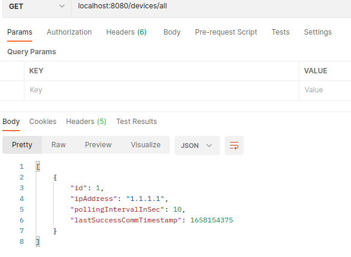
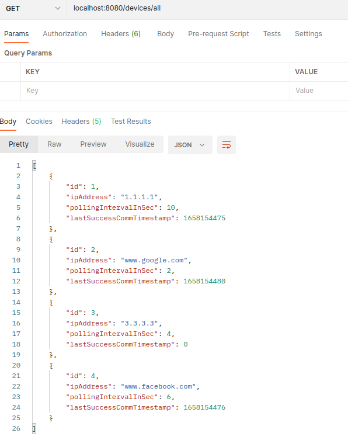

# Rest Interface

## Run (terminal)
```shell
cd rest/
sudo mvn spring-boot:run
```

## Run on a specific port

```shell
cd rest/
mvn spring-boot:run -Dspring-boot.run.arguments=--server.port=9000
```

## Compile
```shell
sudo mvn compile
```

The port can also be changed in the [application properties file](https://github.com/joaogferreira/rest/blob/main/target/classes/application.properties).

There is also a [JAR](https://github.com/joaogferreira/rest/blob/main/JAR/rest-0.0.1-SNAPSHOT.jar) that lets you run the project.
## Endpoints 

| Type   | Endpoint            | Parameters | Description                           | Request Body (JSON) |
|--------|---------------------|------------|---------------------------------------|---------------------|
| GET    | devices/all         | -          | Get all the devices in the network    | -                   |
| GET    | devices/listAddress | -          | Get all the addresses in the network  | -                   |
| POST   | devices/add         | -          | Add a device to the network           | (1)                 |
| POST   | devices/addList     | -          | Add a list of devices to the network  | (2)                 |
| DELETE | devices/delete/{id} | id         | Delete a device from the network      | -                   |


## JSON objects used

(1) JSON used in endpoint /devices/add:
```json
[
    {
    "ipAddress": "1.1.1.1",
    "pollingIntervalInSec": 10
    }
]
```

(2) JSON used in endpoint /devices/addList:
```json
[
    {
        "ipAddress": "www.google.com",
        "pollingIntervalInSec": 2 
    },
    {
        "ipAddress": "3.3.3.3",
        "pollingIntervalInSec": 4 
    },
    {
        "ipAddress": "www.facebook.com",
        "pollingIntervalInSec": 6
    }

]
```

## Use cases

### Use case 1 - Add a device 

Initially, the network is empty.


Add a new device to the network:


The network has a new element.



### Use case 2 - Add a list of devices 

This use case is a continuation of use case 1.

Add a list of devices to the network:


The network has 3 new elements.



### Use case 3 - Get all devices

This use case was tested in the previous examples (endpoint devices/all/ ).

### Use case 4 - Get all addresses being tested 

This use case is a continuation of use case 2.


### Use case 5 - Delete a device

Current devices list:


Removing device with ID equal to 1:


Current devices list (id 1 deleted):


## Technologies used:

Java

Maven

Spring boot 
